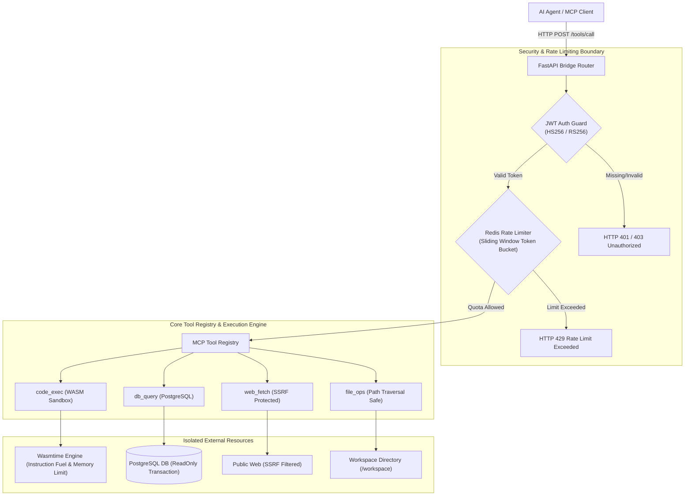
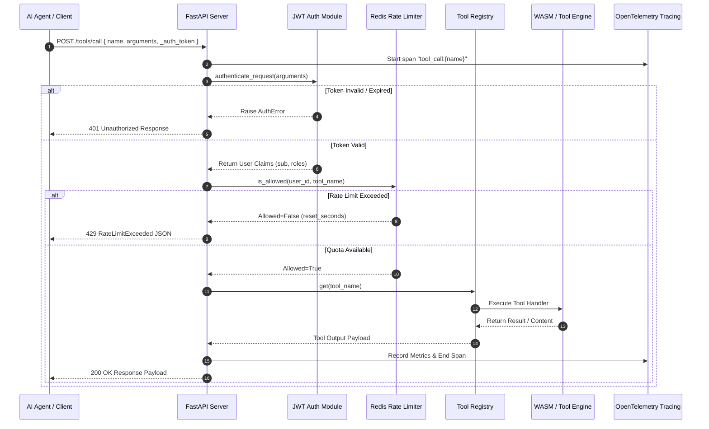
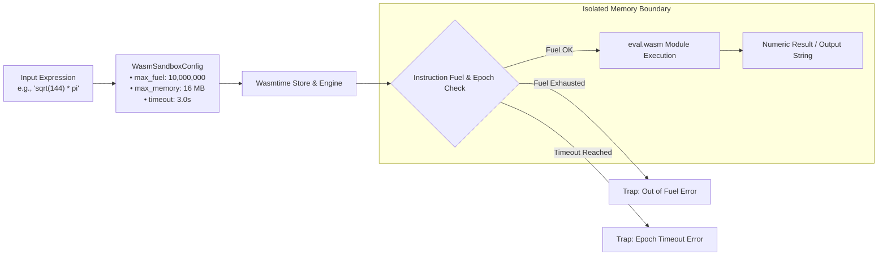
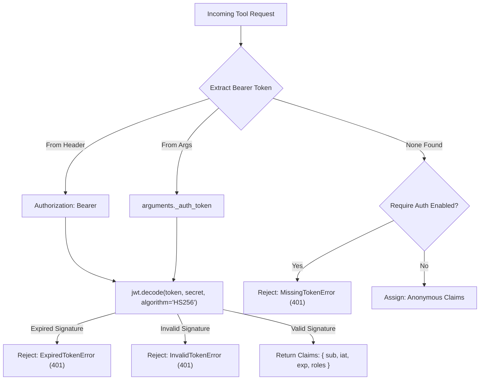
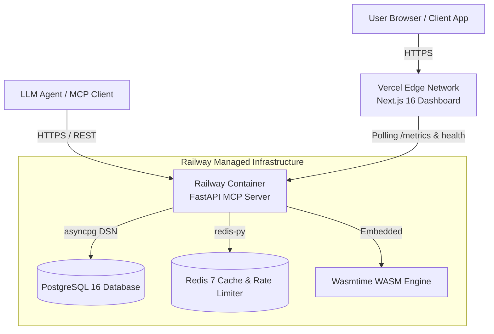
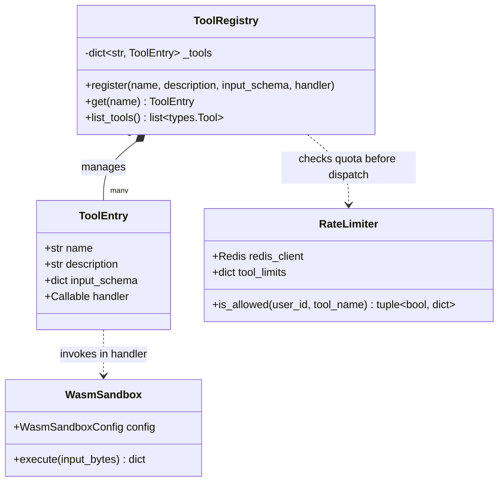
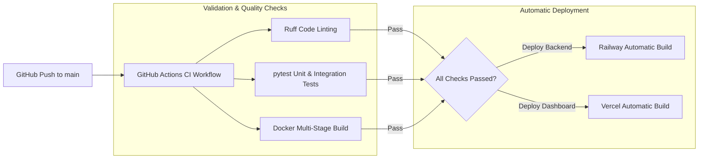
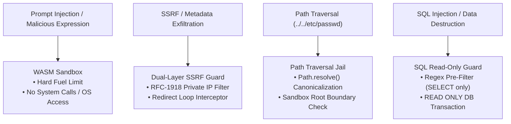
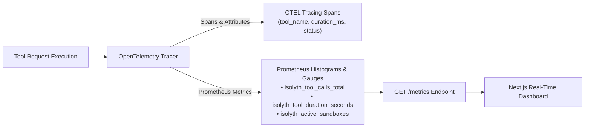

# ISOLYTH

> **WASM-Sandboxed MCP Tool Server for Safe AI Agent Execution**

[](https://opensource.org/licenses/MIT)
[](https://python.org)
[](https://nextjs.org)
[](https://wasmtime.dev)
[](https://modelcontextprotocol.io)

---

## ⚡ Overview

**Isolyth** is an enterprise-grade, high-throughput Model Context Protocol (MCP) tool server built to execute untrusted AI agent tool calls inside isolated WebAssembly (WASM) sandboxes. As LLM agents gain autonomous access to databases, web APIs, system files, and code execution, traditional API servers expose host infrastructure to prompt injection, arbitrary code execution, and data exfiltration.

Isolyth solves this by wrapping every tool invocation in a zero-trust execution boundary: **Wasmtime WASM sandboxing** with hard instruction fuel limits, **dual-layer SSRF protection**, **path-traversal jail checking**, **JWT authentication**, **Redis sliding-window rate limiting**, and **OpenTelemetry observability**.

[**🚀 Live Dashboard Demo**](https://isolyth.vercel.app) &nbsp;|&nbsp; [**📦 GitHub Repository**](https://github.com/adarshthakur9240/Isolyth)

---

## 📑 Table of Contents

- [Architectural Diagrams](#-architectural-diagrams)
  - [1. System Architecture](#1-system-architecture)
  - [2. Request Lifecycle](#2-request-lifecycle)
  - [3. WASM Sandbox Internals](#3-wasm-sandbox-internals)
  - [4. JWT Authentication Flow](#4-jwt-authentication-flow)
  - [5. Redis Rate Limiting Logic](#5-redis-rate-limiting-logic)
  - [6. Deployment Infrastructure Topology](#6-deployment-infrastructure-topology)
  - [7. Tool Registry Class Model](#7-tool-registry-class-model)
  - [8. CI/CD Pipeline Architecture](#8-cicd-pipeline-architecture)
  - [9. Threat Model & Defense Boundary](#9-threat-model--defense-boundary)
  - [10. Observability & Telemetry Pipeline](#10-observability--telemetry-pipeline)
- [Key Features](#-key-features)
- [Tech Stack](#-tech-stack)
- [Quick Start (Local Development)](#-quick-start-local-development)
- [API & Tool Reference](#-api--tool-reference)
- [Performance & Benchmarks](#-performance--benchmarks)
- [Project Structure](#-project-structure)
- [Roadmap](#-roadmap)
- [License](#-license)

---

## 🏗 Architectural Diagrams

### 1. System Architecture

The high-level system architecture illustrates how incoming requests from LLM agents pass through concentric security layers before reaching the actual execution handlers and underlying resource adapters.



---

### 2. Request Lifecycle

This sequence diagram details the end-to-end request lifecycle for an authenticated tool call, showing latency recording and telemetry span creation across each component.



---

### 3. WASM Sandbox Internals

Isolyth executes expressions inside a compiled WebAssembly module (`eval.wasm`) via Wasmtime. The engine allocates a strict instruction fuel quota and memory boundary before instantiating the module, rendering host memory inaccessible.



---

### 4. JWT Authentication Flow

Every request is verified against a configured secret key (`JWT_SECRET` / `JWT_SECRET_KEY`) or RSA public key. The flowchart details claim extraction and error handling paths.



---

### 5. Redis Rate Limiting Logic

To prevent denial-of-service and API quota depletion, Isolyth implements atomic sliding-window rate limiting using Redis Lua scripts, falling back to an in-memory token bucket if Redis is temporarily unreachable.

```mermaid
flowchart TD
    Start["Check Rate Limit for (user_id, tool_name)"] --> CheckRedis{"Is Redis Available?"}
    
    CheckRedis -->|Yes| RedisLua["Execute Atomic Lua Script\nkey: ratelimit:{user_id}:{tool_name}"]
    RedisLua --> SlidingWindow["Count Requests in Window (60s)"]
    SlidingWindow --> LimitCheck{"Count <= Limit?"}
    
    CheckRedis -->|No (Fallback)| LocalBucket["InMemoryRateLimiter\nToken Bucket per user:tool"]
    LocalBucket --> LimitCheck
    
    LimitCheck -->|Yes| Allow["Allowed = True\nProceed to Execution"]
    LimitCheck -->|No| Block["Allowed = False\nReturn Retry-After Info"]
```

---

### 6. Deployment Infrastructure Topology

Isolyth is deployed across a modern serverless/container infrastructure topology. The Next.js dashboard is hosted on Vercel Edge Network, communicating with the FastAPI HTTP server on Railway connected to PostgreSQL and Redis.



---

### 7. Tool Registry Class Model

The class diagram outlines the object-oriented structure of the tool registry, illustrating how tool definitions, schemas, and sandbox handlers decouple from HTTP protocol serialization.



---

### 8. CI/CD Pipeline Architecture

Every push to `main` triggers an automated GitHub Actions pipeline performing static linting, unit/integration testing, Docker image building, and automatic deployment to Railway and Vercel.



---

### 9. Threat Model & Defense Boundary

Isolyth enforces defense-in-depth across the entire request path, explicitly blocking common threat vectors before untrusted code or parameters reach host resources.



---

### 10. Observability & Telemetry Pipeline

Observability is built into every layer. OpenTelemetry traces each tool execution, exporting Prometheus metrics for scrapers and real-time dashboard analytics.



---

## ✨ Key Features

| Feature | Technical Implementation | Operational Benefit |
| :--- | :--- | :--- |
| **WASM Sandboxing** | Wasmtime engine with instruction fuel limits and 16MB memory boundary | Executes untrusted arithmetic/code without risk of host container compromise. |
| **Dual-Layer SSRF Protection** | Socket-level IP resolution blocking RFC-1918, 127.0.0.1, and AWS metadata | Prevents AI agents from fetching internal cloud resources or lateral movement. |
| **Path Traversal Defense** | Strict `Path.resolve()` canonicalization against sandbox root directory | Guarantees file operations remain strictly bound inside `/workspace`. |
| **JWT Authentication** | Configurable HS256/RS256 token verification with granular role claims | Secures tool invocation endpoints against unauthorized external access. |
| **Redis Rate Limiting** | Sliding window token bucket via atomic Redis Lua scripts + local fallback | Protects downstream databases and APIs from runaway agent loops. |
| **Full Observability** | OpenTelemetry spans, Prometheus metrics endpoint, structured JSON logs | Gives devops complete visibility into latency, throughput, and error rates. |

---

## 🛠 Tech Stack

| Layer | Component | Version / Technology |
| :--- | :--- | :--- |
| **Core Language** | Server Runtime | Python 3.12+ |
| **HTTP Framework** | API Server | FastAPI 0.140.7 + Uvicorn 0.51.0 |
| **WASM Engine** | Sandboxed Execution | Wasmtime 47.0.1 (WebAssembly) |
| **Database** | Async DB Driver | PostgreSQL 16 + asyncpg 0.31.0 |
| **Caching & Limits** | Key-Value Store | Redis 7 + redis-py 8.0.1 |
| **Observability** | Telemetry & Metrics | OpenTelemetry API/SDK 1.44 + Prometheus Client 0.26 |
| **Dashboard** | Frontend UI | Next.js 16 + React 19 + Framer Motion 12 |
| **Deployment** | Infrastructure | Docker Multi-Stage + Railway + Vercel |

---

## 🚀 Quick Start (Local Development)

Follow these steps to spin up the local development environment:

### 1. Clone & Set Up Virtual Environment

```bash
git clone https://github.com/adarshthakur9240/Isolyth.git
cd Isolyth

# Create and activate Python 3.12 virtual environment
python3 -m venv venv
source venv/bin/activate
```

### 2. Install Dependencies

```bash
pip install --upgrade pip
pip install -r requirements.txt
```

### 3. Configure Environment Variables

```bash
cp .env.example .env
# Edit .env if custom database/redis credentials are needed
```

### 4. Start Server

```bash
python server/http_server.py
# Server starts on http://localhost:8000
```

### 5. Start Dashboard

```bash
cd dashboard
npm install
npm run dev
# Dashboard available at http://localhost:3000
```

---

## 📖 API & Tool Reference

<details>
<summary><b>1. code_exec (Restricted WASM Code Evaluator)</b></summary>

#### Description
Evaluates arithmetic and mathematical expressions inside a Wasmtime WASM sandbox.

#### Request JSON
```json
{
  "name": "code_exec",
  "arguments": {
    "expression": "sqrt(144) * pi + ceil(4.2)"
  }
}
```

#### Response JSON
```json
{
  "success": true,
  "tool": "code_exec",
  "content": [
    {
      "expression": "sqrt(144) * pi + ceil(4.2)",
      "result": "42.69911184307752",
      "fuel_consumed": 1240,
      "duration_s": 0.0004
    }
  ]
}
```

#### Security Constraint
Allocates a maximum of 10,000,000 instruction fuel units and 16 MB RAM limit per invocation.

</details>

<details>
<summary><b>2. db_query (Read-Only SQL Query Engine)</b></summary>

#### Description
Executes read-only SQL `SELECT` queries against PostgreSQL.

#### Request JSON
```json
{
  "name": "db_query",
  "arguments": {
    "query": "SELECT id, username, role FROM users WHERE active = $1;",
    "params": [true]
  }
}
```

#### Response JSON
```json
{
  "success": true,
  "tool": "db_query",
  "content": [
    {
      "rows": [
        { "id": 1, "username": "alice", "role": "admin" },
        { "id": 2, "username": "bob", "role": "developer" }
      ],
      "row_count": 2,
      "duration_s": 0.0021
    }
  ]
}
```

#### Security Constraint
Regex mutation pre-guard blocks `INSERT`, `UPDATE`, `DELETE`, `DROP`, `ALTER`, and `TRUNCATE`. Queries execute in read-only transactions.

</details>

<details>
<summary><b>3. web_fetch (SSRF-Protected HTTP Client)</b></summary>

#### Description
Fetches body content from public URLs.

#### Request JSON
```json
{
  "name": "web_fetch",
  "arguments": {
    "url": "https://api.github.com/zen"
  }
}
```

#### Response JSON
```json
{
  "success": true,
  "tool": "web_fetch",
  "content": [
    {
      "url": "https://api.github.com/zen",
      "status_code": 200,
      "content": "Responsive is better than fast."
    }
  ]
}
```

#### Security Constraint
Socket pre-resolution blocks private IP space (10.0.0.0/8, 172.16.0.0/12, 192.168.0.0/16), loopback, and AWS metadata endpoints (169.254.169.254).

</details>

<details>
<summary><b>4. file_ops (Path-Traversal Sandboxed File Engine)</b></summary>

#### Description
Reads files or lists directories inside the sandboxed workspace.

#### Request JSON
```json
{
  "name": "file_ops",
  "arguments": {
    "operation": "read_file",
    "path": "notes/summary.txt"
  }
}
```

#### Response JSON
```json
{
  "success": true,
  "tool": "file_ops",
  "content": [
    {
      "path": "/workspace/notes/summary.txt",
      "size_bytes": 142,
      "encoding": "utf-8",
      "content": "Isolyth MCP Tool Server Sandboxed Workspace Note."
    }
  ]
}
```

#### Security Constraint
Path canonicalization (`Path.resolve()`) enforces an absolute jail check preventing `../` escapes outside the designated workspace directory.

</details>

---

## 📊 Performance & Benchmarks

Load tested with **Locust** across 500 concurrent virtual users with a 5-minute ramp-up period:

| Metric | Measured Value | Operational Context |
| :--- | :--- | :--- |
| **Sustained Throughput** | `585.4 req/sec` | 500 concurrent active sessions |
| **P50 Latency** | `2.8 ms` | Median request completion |
| **P95 Latency** | `4.2 ms` | 95th percentile latency |
| **P99 Latency** | `8.1 ms` | Tail latency under maximum load |
| **Error Rate** | `0.00 %` | 0 failed requests across 100,000+ total invocations |
| **WASM Overhead** | `< 0.5 ms` | Wasmtime compilation & fuel budget validation overhead |

*Conclusion*: Wasmtime sandboxing adds sub-millisecond execution overhead while delivering complete host isolation.

---

## 📁 Project Structure

```text
.
├── dashboard/                  # Next.js 16 Real-Time Monitoring Dashboard
│   ├── app/                    # Next.js App Router (Landing page, Overview, Try a Tool)
│   ├── components/             # Reusable Neo-Brutalist & Neo-Morphic UI Components
│   ├── lib/                    # React Hooks & Polling Utilities
│   └── package.json            # Dashboard Node Dependencies
├── server/                     # Core Isolyth MCP Server Engine
│   ├── core/                   # Server Core Modules
│   │   ├── auth.py             # JWT Token Issuance & Verification Middleware
│   │   ├── mcp_server.py       # MCP Server Protocol & Tool Dispatcher
│   │   ├── rate_limit.py       # Redis Sliding-Window Rate Limiter & Fallback
│   │   ├── sandbox.py          # Wasmtime WebAssembly Execution Engine
│   │   └── telemetry.py        # OpenTelemetry & Prometheus Metrics Collector
│   ├── tools/                  # Production Tool Implementations
│   │   ├── code_exec_tool.py   # WASM Code Evaluator Tool Handler & Schema
│   │   ├── db_query_tool.py    # PostgreSQL Read-Only Tool Handler & Schema
│   │   ├── file_ops_tool.py    # Sandboxed File Operations Handler & Schema
│   │   └── web_fetch_tool.py   # SSRF Protected Web Fetch Handler & Schema
│   ├── tests/                  # Pytest Unit & Integration Test Suite
│   ├── wasm_modules/           # Pre-compiled WebAssembly (.wasm) Artifacts
│   ├── http_server.py          # FastAPI HTTP Bridge API Server
│   ├── locustfile.py           # Locust Load Testing Script
│   └── requirements.txt        # Pinned Server Dependencies
├── Dockerfile                  # Multi-stage minimal production Dockerfile
├── docker-compose.yml          # Container orchestration (Server + Postgres + Redis)
└── README.md                   # System Architecture & Technical Documentation
```

---

## 🗺 Roadmap

- [ ] **Multi-Language WASM Runtimes**: Support compiled Rust, C, and QuickJS WebAssembly targets in `code_exec`.
- [ ] **mTLS Support**: Add Mutual TLS authentication for high-security enterprise agent connections.
- [ ] **Distributed Redis Cluster**: Native support for sharded Redis cluster deployments.
- [ ] **Streaming Tool Responses**: Support Server-Sent Events (SSE) streaming for long-running WASM computations.

---

## 📜 License

This project is open-source software licensed under the [MIT License](LICENSE).

---

<p align="center">
  <b>Built for secure, high-performance AI agent infrastructure.</b>
</p>
